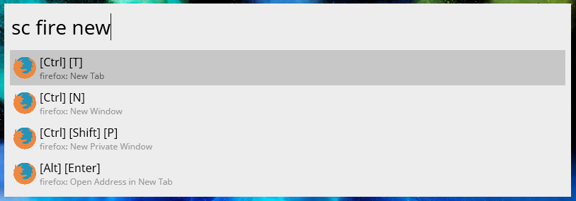

# Keyboard Shortcuts Plugin for Wox

A plugin for the Windows launcher [Wox](https://github.com/Wox-launcher/Wox) to quickly search for keyboard shortcuts of a number of programs.  



## Install

In Wox, type:  
```
wpm install Keyboard shortcuts
```
See more details on the [plugin's page](http://www.getwox.com/plugin/165).  

## Use
Type 
```
sc program function
```
where `program` is the name of the program, and `function` is what you're trying to do.  
For example, to find the shortcuts for tabs in Firefox, search for:  
```
sc firefox tab 
```

## Data

The shortcuts data is collected by [DuckDuckGo](https://duckduckgo.com/) and is made publicly available via their [Instant Answers repo](https://github.com/duckduckgo/zeroclickinfo-goodies) under the [Apache 2.0 license](https://github.com/duckduckgo/zeroclickinfo-goodies/blob/master/LICENSE).  
[Check out the full list of those programs](https://github.com/duckduckgo/zeroclickinfo-goodies/tree/master/share/goodie/cheat_sheets/json).  

